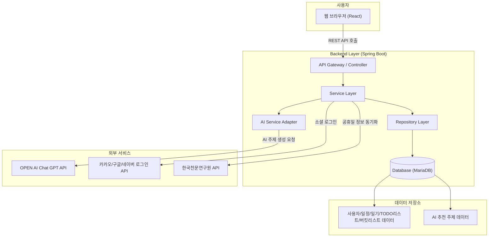

# TropiCal 플랫폼 - 시스템 아키텍처

본 문서는 TropiCal 플랫폼의 **전체 시스템 아키텍처**를 정의합니다.
플랫폼의 핵심 구성 요소(프론트엔드, 백엔드, 데이터베이스, AI 서비스, 외부 연동 등)와 그 상호작용 방식을 설명합니다.

**작성자**: [신동준](https://github.com/sdj3959)

**문서 버전**: v1.0

**대상 독자:**

*   **프론트엔드 개발자**: API 호출 및 UI 흐름 이해
*   **백엔드 개발자**: 서비스/도메인/DB 계층 아키텍처 파악
*   **운영자/PM**: 시스템 구성과 데이터 흐름 이해
*   **QA/테스터**: 아키텍처 기반 시나리오 테스트 설계
*   **투자자/신규 합류자**: 플랫폼의 기술 구조 한눈에 이해

---

## 1. 전체 아키텍처 개요

TropiCal은 **사용자의 일정/일기/TODO리스트/버킷리스트 데이터를 기반으로 AI가 맞춤형 스몰토크 주제를 추천하는 웹 플랫폼**으로, 주요 아키텍처는 다음과 같이 구성됩니다.

*   **Frontend (React/JS)**
    사용자 인터페이스, 캘린더 뷰, 일정/일기/TODO리스트/버킷리스트 CRUD, AI 추천 주제 카드 표시

*   **Backend (Spring Boot)**
    REST API 제공, 비즈니스 로직, JWT 기반 인증/인가, AI 프롬프트 생성 및 API 호출

*   **Database (MariaDB)**
    사용자, 일정, 일기, TODO, 버킷리스트, AI 추천 주제, 공휴일, 약관 동의 데이터 저장

*   **AI Service (Google Gemini API)**
    *   사용자 기록(일정, 일기, TODO, 버킷리스트) 분석
    *   맥락 기반 스몰토크 주제 및 예시 문장 생성
    *   생성된 주제 저장 및 관리

*   **External Service (외부 서비스 연동)**
    *   **카카오/구글/네이버 소셜 로그인**: 간편 회원가입/로그인 제공
    *   **한국천문연구원 특일 API**: 캘린더에 공휴일 정보를 동기화

*   **Infra / Cloud** (추후 확장)
    Docker 기반 컨테이너, CI/CD (GitHub Actions), 클라우드 배포(AWS) 고려

---

## 2. 아키텍처 다이어그램 (Mermaid)

---

## 3. 주요 데이터 흐름

1.  **회원가입/로그인 (로컬 & 소셜)**
    *   **로컬:** FE → BE → DB (`user` 테이블, JWT 기반 인증)
    *   **소셜:** FE → 카카오/구글/네이버 서버 → FE(인가코드) → BE(토큰) → 카카오/구글/네이버 API(정보요청) → BE → DB (`user`, `social_account` 테이블, JWT 발급)
    *   **온보딩:** 최초 회원가입 시, 필수/선택 약관 동의 정보를 DB에 저장

2.  **일정/일기/TODO리스트/버킷리스트 CRUD**
    *   **생성/수정:** FE에서 사용자 입력 → BE → DB (`schedule`, `diary`, `todo` 또는 `bucket` 테이블에 저장)
    *   **AI 연동:** 데이터 저장 후, **비동기(Async)** 로 AI Service Adapter를 호출하여 스몰토크 주제 생성을 트리거.

3.  **AI 스몰토크 주제 생성**
    *   **데이터 수집:** AI Service Adapter가 사용자의 최근 일정/일기 데이터를 DB에서 조회.
    *   **프롬프트 생성:** 수집된 데이터를 바탕으로 Gemini API에 전송할 프롬프트를 동적으로 구성.
    *   **API 호출:** Gemini API를 호출하여 스몰토크 주제(JSON 형식)를 응답받음.
    *   **저장:** 응답받은 주제를 파싱하고 검증한 후, DB의 `smalltalk_topic` 테이블에 저장.

4.  **AI 스몰토크 주제 조회**
    *   **요청:** 사용자가 메인 화면(캘린더 뷰)에 진입.
    *   **응답:** FE → BE → DB (`smalltalk_topic` 테이블에서 해당 사용자의 최신 주제 조회) → FE에 전달하여 카드 형태로 표시.

5.  **공휴일 정보 동기화**
    *   **주기적 실행:** 백엔드 스케줄러(또는 수동 실행)가 한국천문연구원 API 호출.
    *   **저장:** 응답받은 공휴일 정보를 DB의 `holiday` 테이블에 저장/업데이트.
    *   **조회:** 사용자가 캘린더 뷰 조회 시, `holiday` 테이블의 정보를 함께 조회하여 UI에 표시.

---

## 4. 운영 고려 사항

*   **보안**: JWT 기반 인증/인가, Spring Security를 통한 Role 기반 API 접근 제어, 비밀번호 암호화(BCrypt).
*   **개인정보**: AI 프롬프트 생성 시, 민감할 수 있는 개인정보(이메일, 전화번호 등)를 마스킹하는 전처리 로직 필요.
*   **성능 최적화**: AI가 생성한 스몰토크 주제를 **캐싱**하여 반복적인 AI API 호출을 최소화. DB 쿼리 최적화를 위한 인덱스 설정.
*   **비용 관리**: Gemini API 호출 횟수 및 토큰 사용량을 로깅하고 모니터링하여 비용을 예측/관리.
*   **확장성**: 현재는 모놀리식 아키텍처로 구현하지만, 향후 트래픽 증가 시 AI 추천 기능을 별도의 마이크로서비스로 분리할 수 있도록 설계.

---

## 5. 추후 업데이트 계획

*   **실시간 알림 시스템 (WebSocket)**: 새로운 스몰토크 주제가 생성되었을 때, 사용자에게 실시간 푸시 알림 전송.
*   **분산 캐싱 (Redis)**: 공휴일 정보나 자주 조회되는 스몰토-크 주제를 Redis에 캐싱하여 DB 부하 감소 및 응답 속도 향상.
*   **데이터 분석 파이프라인**: 사용자가 어떤 종류의 스몰토크 주제를 선호하는지 데이터를 수집/분석하여 AI 프롬프트를 고도화.
*   **클라우드 네이티브 배포**: AWS EC2, RDS, S3 등을 활용하여 서비스 안정성 및 확장성 확보.
