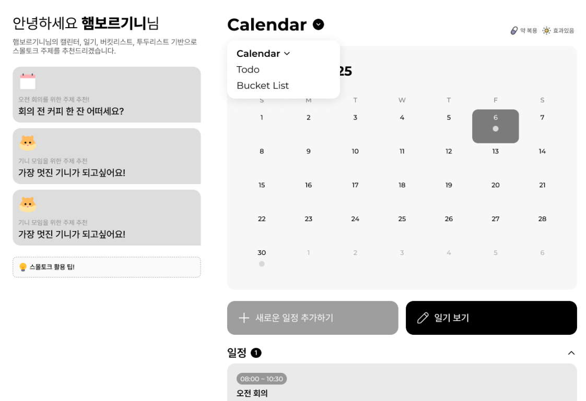
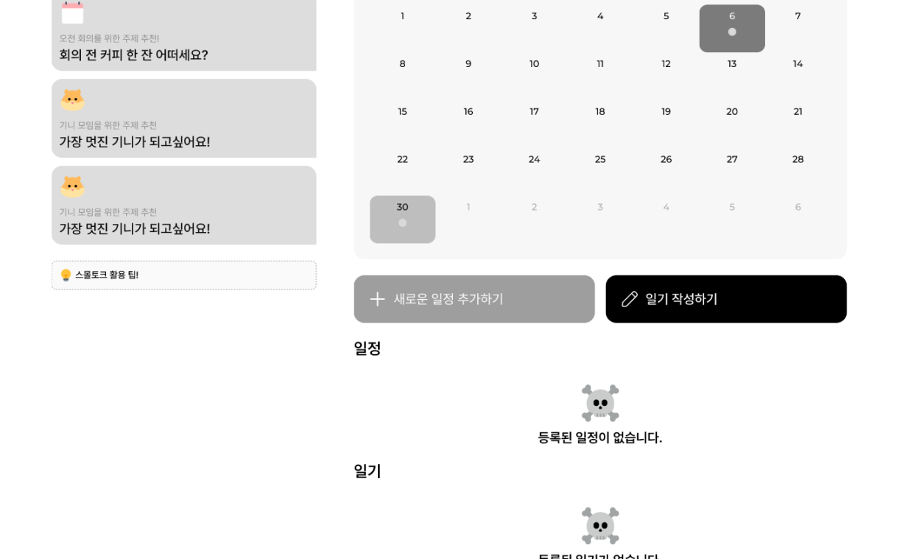
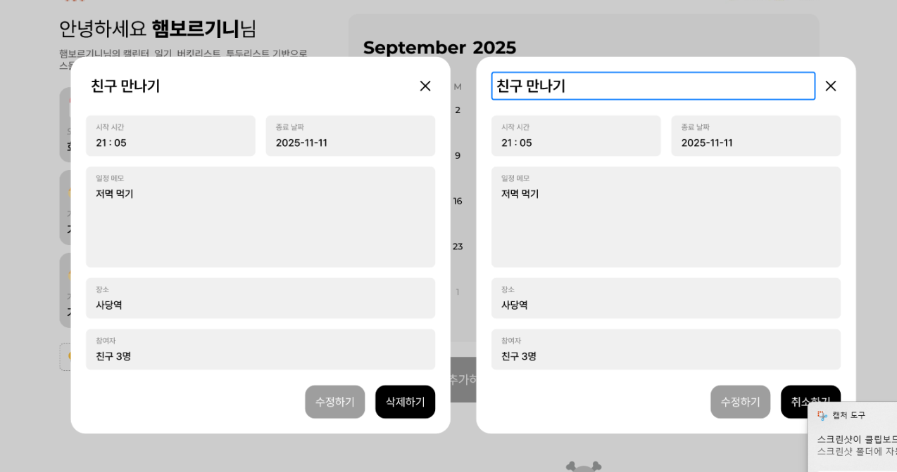
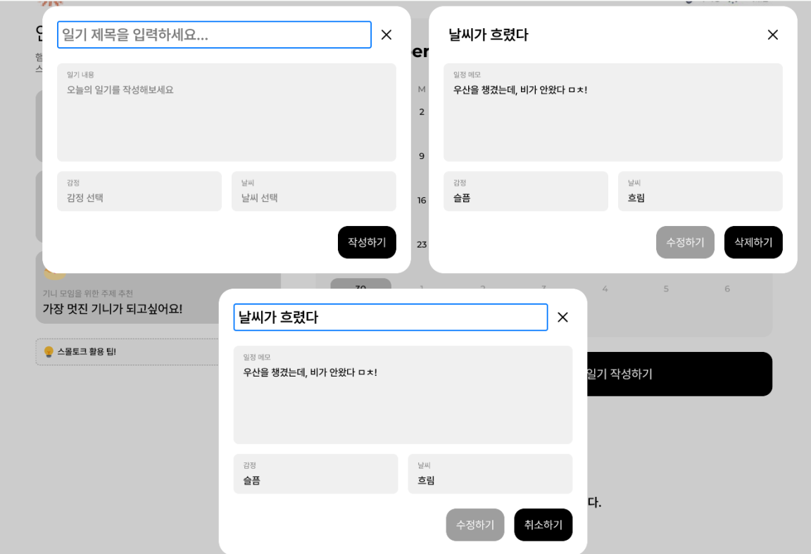
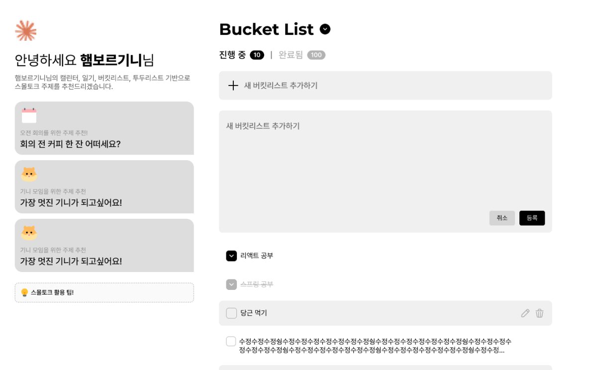

# AiceMelt 팀 회의록

## 1. 회의 개요

* **일시**: 2025.09.10
* **장소**: 학원
* **참석자**: 백승현, 신동준, 왕택준, 진도희
* **작성자**: [백승현](https://github.com/Sirosho)

---

## 2. 오늘 다룬 의제

* 로그인 및 회원가입 기능 구체화
* 약관 동의 제안 방식
* TodoList 디자인
* AI 조언 테이블 데이터 관리 방안
* 사용할 라이브러리 및 개발 도구 정리

---

## 3. 주요 논의

* **로그인 및 회원가입 기능**
    * 카카오 소셜 로그인을 기본 기능으로 연동하는 것에 대해 논의함.
    * 왕택준: 회원 정보 수정을 위한 마이페이지와 소셜 로그인을 위한 별도 테이블의 필요성을 제안함.
    * 회원의 종류를 카카오 유저와 일반 회원가입 유저로 구분하기로 함.
    * **이슈**: `user` 테이블과 소셜 가입 테이블에 필요한 구체적인 컬럼이 아직 확정되지 않음.

* **약관 동의 제안 방식**
    * **방식 1**: 회원가입 시 온보딩(Onboarding) 형태로 약관 동의 절차를 포함.
    * **방식 2**: 미동의 유저에게는 AI 추천 기능 사용 시 툴팁 등으로 동의를 유도하고, 동의 유저에게는 개인화된 추천을 제공.

* **TodoList 디자인**
    * **이슈 1**: Todo 내용이 길어질 경우 UI에서 어떻게 표현할지 논의.
    * **이슈 2**: 내용 입력 및 조회 방식을 모달로 할지, 드롭다운으로 할지 논의.

* **AI 조언 테이블 데이터 관리**
    * **이슈**: AI 조언 데이터가 최신화될 때, 이전 데이터를 삭제할지 유지할지 여부와 데이터 조회 기준에 대해 논의함.

* **라이브러리 및 개발 도구**
    * 프로젝트 초기 세팅을 위해 사용할 기술 스택과 도구를 확정함.

---

## 4. 결정 사항

* **로그인/회원가입**: 카카오 API 명세를 분석한 후, 이를 바탕으로 기능 명세서와 테이블 구조를 구체화하여 재정의하기로 함.(담당: **왕택준**)

* **약관 동의**: **방식 1(온보딩)과 방식 2(기능 사용 시 유도)를 모두 적용**하기로 함.

* **TodoList 디자인**:

    * 내용 길이에 제한을 두고, 가로 박스 형태로 표시하되 **클릭 시 전체 내용이 펼쳐지는 방식**으로 구현.
    * **체크박스를 통한 관리 기능**을 추가하기로 함.

* **AI 조언 데이터**: 최신화된 조언을 우선적으로 제공하되, **이전 데이터는 삭제하지 않고 유지**함. (조언 중복 문제는 추후 개선)

* **개발 환경**:
    * **라이브러리**: 이전에 실습에서 사용했던 모든 라이브러리를 우선 등록 후 사용.
    * **데이터베이스**: **MariaDB**를 메인으로 사용하며, 필요시 H2 사용을 고려.
    * **설정 파일**: 민감 정보 보호를 위해 **.env** 파일 사용.
    * **포트 번호**: 프론트엔드 `5005`, 백엔드 `9005`로 통일.

---

## 5. 공통 작업

* (회의 중 공동 합의·진행 사항 없음)

---

## 6. 개별 담당

* **왕택준**
    * 카카오 API 분석 내용 반영하여 기능 명세서 추가 작업
    * 플랫폼 로고 디자인 구상

* **진도희**
    * 결정된 디자인 사항을 반영하여 와이어 프레임 작업

* **백승현**
    * 결정된 디렉토리 구조 및 라이브러리 반영하여 프로젝트 생성 후 GitHub 공유

* **신동준**
    * 결정된 디렉토리 구조 및 라이브러리 반영하여 프로젝트 생성 후 GitHub 공유

---

## 7. 리스크 및 이슈

* (해당 사항 없음)

---

## 8. 차기 회의 계획

* **일정**: 2025.09.11

* **예상 의제**:
    * 필요한 문서(API 명세서 등)와 역할 나누기
    * DB 설계 완료 및 엔터티(Entity) 등록
    * 프로젝트 전체 일정 정리 및 공유

## 9. 첨부 자료

### 9.1. 현재까지 진행 된 와이어프레임

### 9.1.1 일정 기능

---
### 9.1.2 일기 기능

---

### 9.1.2 Todo 및 버킷리스트 기능

---

### 9.2. 로고

