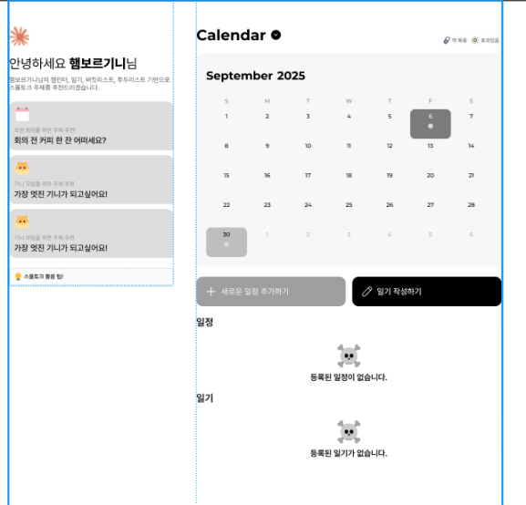
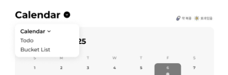
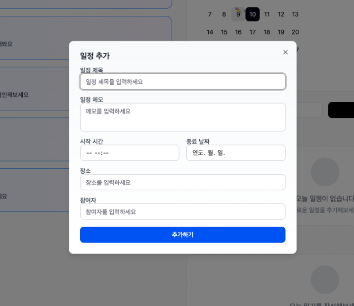
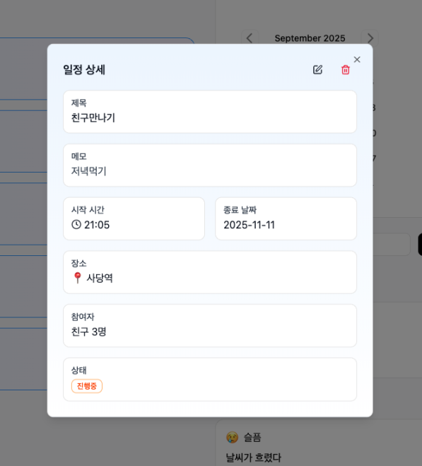

 # 팀 AiceMelt 회의록

## 1. 회의 개요

* **일시**: 2025.09.09
* **장소**: 학원
* **참석자**: 백승현, 신동준, 왕택준, 진도희
* **작성자**: [백승현](https://https://github.com/Sirosho)

---

## 2. 오늘 다룬 의제

* DB 설계 구상
* 플랫폼 이름 정하기
* 와이어 프레임(세부요소)
* 공통 헤더 및 푸터 적용 여부

---

## 3. 주요 논의

* **DB 설계 구상**
    * 각 팀원이 작성한 기능 명세서를 기반으로 DB 설계 구상 진행
        * **이슈 1**: 캘린더 테이블의 필요성은 인지했으나, 포함될 컬럼이 확정되지 않음.
        * **이슈 2**: ShouldHave 기능인 '알림'을 위한 테이블 컬럼을 미리 생성할지 여부.
        * **이슈 3**: AI 조언 테이블의 구체적인 컬럼 구성에 대한 논의.

* **플랫폼 이름 정하기**
    * 리스트업 된 이름들 중 팀원 투표를 통해 선정.
        * **왕택준**: MeltUP, Tropical, Que-lender, 챗린더
        * **백승현**: MeltUP, 톡픽 캘린더, 플랜웜
        * **신동준**: Tropical, Mingleday, 챗린더, 어버버
        * **진도희**: Tropical, 말칼말칼, Que-lender

* **와이어프레임(세부요소)**

    * 캘린더 하단에 드롭다운 형식으로 일정 및 일기 관리 기능 배치.
        * 일기는 모달을 통해 내용 바로 표시.
        * 일정은 '일정보기' 버튼 클릭 시 하단에 리스트 렌더링.

    * 캘린더 제목 옆 버튼 클릭 시 `TodoList`, `버킷리스트`로 이동하는 드롭다운 메뉴 배치.
        * **TodoList**: '진행중', '미완료', '완료됨'으로 상태 구분.
        * **버킷리스트**: '진행중', '완료됨'으로 상태 구분.

    * AI 스몰토크 조언 기능은 스케줄러를 이용해 특정 시간에 일괄 업데이트.

* **공통 헤더 및 푸터**
    * 공통 헤더와 푸터의 필요성에 대해 논의함.

* **디렉토리 구조 논의**
    * 디렉토리 구조 방식에 대해 논의함

---

## 4. 결정 사항

* **DB 설계**:
    * **이슈 1**: 캘린더 테이블은 우선 생성 후, 개발 중 필요에 따라 수정.
    * **이슈 2**: 알림 기능 등 ShouldHave 기능은 MVP 개발 완료 후 추가 및 수정.
    * **이슈 3**: AI 조언 테이블은 기능 명세 구체화 후 차기 회의에서 컬럼 확정.
* **네이밍**:
    * **플랫폼명**: Tropical
    * **프로젝트명**: WarmUpDate
    * **팀명**: AiceMelt
* *공통 헤더 및 푸터**:
    * 공통 헤더는 불필요, 공통 푸터는 필요함.
* **디렉토리 구조**:
    * **프론트엔드**: 기능별 디렉토리 구조
    * **백엔드**: 계층형 디렉토리 구조

---

## 5. 공통 작업 (회의 후 공통 TODO)

* 결정된 디렉토리 구조 반영하여 Git Repository 생성
* DB 설계 완료 및 엔터티(Entity) 생성
* 프로젝트 관련 문서 작성 역할 분담
* API 요청 URL 규칙 합의 및 API 명세서 작성
* 프로젝트에 사용할 라이브러리 목록 정리
* 플랫폼 메인 색상 선정

---

## 6. 개별 담당

* **백승현**
    - todolist 및 버킷리스트 기능명세서 작성
    - 디렉토리 구조 초안 설계

* **왕택준** 
    - 플랫폼 개요 및 협업 규칙 문서 정리
    - 회원가입 및 로그인 기능명세서 작성
    - 캘린더 관련 Api 분석 및 권한 신청 (`한국천문연구원_특일 정보 API`)

* **진도희**
    - AI 스몰토크 조언 기능명세서 작성
    - 전반적인 디자인 컨셉 구상 및 와이어 프레임 제작(Figma)

* **신동준**
    - 일정 및 일기 기능명세서 작성
    - 일정 및 일기 와이어 프레임 제작(Figma)

---

## 7. 리스크 및 이슈

* **캘린더 테이블**: 구체적인 컬럼이 확정되지 않아 추후 수정 가능성 존재.
* **알림 기능**: MVP 범위에 포함되지 않아 추후 DB 수정 및 기능 추가 필요.
* **AI 조언 테이블**: 구체적인 컬럼 구성에 어려움이 있음. 추후 회의를 통하여 컬럼 정의 예정

---

## 8. 차기 회의 계획

* **일정**: 2025.09.10
* **예상 의제**:
    * AI 조언 테이블 컬럼 확정
    * DB 설계 최종 완료
    * 문서 작성 역할 분담
    * API 명세서 작성 논의
    * 플랫폼 메인 색상 결정

## 9. 첨부 자료

### 9.1. 현재까지 진행 된 와이어프레임

---
